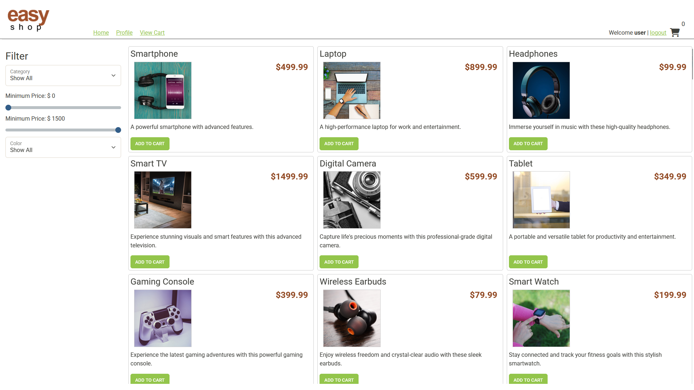
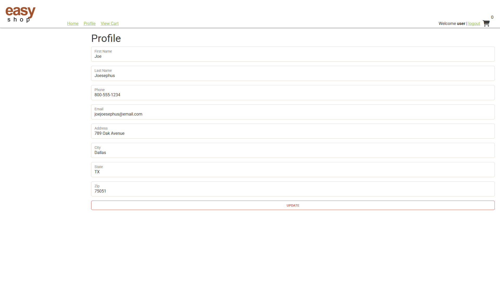
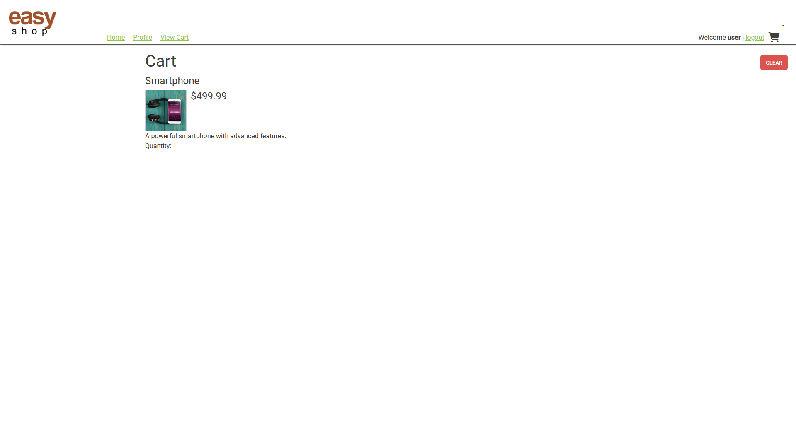

# E-Commerce Capstone 3

A RESTful e-commerce backend built with **Java**, **Spring Boot**, **Spring Security**, **JWT Authentication**, **Spring Data JPA**, and **MySQL**. This project was completed as the Capstone for the Year Up United Application Development program and demonstrates secure authentication, role-based authorization, and persistent shopping cart functionality.

---





### Interesting Code:
```
package org.yearup.config;

import org.springframework.context.annotation.Configuration;
import org.springframework.web.servlet.config.annotation.CorsRegistry;
import org.springframework.web.servlet.config.annotation.WebMvcConfigurer;

@Configuration
public class WebMvcConfig implements WebMvcConfigurer {

    @Override
    public void addCorsMappings(CorsRegistry registry) {
        registry.addMapping("/**")
                .allowedOrigins("http://localhost:63342")
                .allowedMethods("GET", "POST", "PUT", "DELETE", "OPTIONS")
                .allowedHeaders("*")
                .allowCredentials(true);
    }
}
```
I enjoyed figuring out this code because it allows requests from IntelliJ's built-in HTML
server to work correctly. IntelliJ has its Frontend at `http://localhost:63342`. I created code that
would allow other HTTP requests such as `"GET", "POST", "PUT", "DELETE', and "OPTIONS"` so that the API does
not get blocked by the browser. I also added on to allow headers and login/session information.


---

## Features

### Authentication
- JWT-based authentication
- Secure user login
- Password encryption
- Role-based authorization
- Protected API endpoints

### User Management
- User registration
- View authenticated user profile
- Update user profile information

### Categories
- View all categories
- View category by ID
- Create categories (Admin)
- Update categories (Admin)
- Delete categories (Admin)

### Products
- View all products
- Search by category
- Search by price range
- Search by subcategory
- View individual product details
- Create products (Admin)
- Update products (Admin)
- Delete products (Admin)

### Shopping Cart
- View current user's shopping cart
- Add products to cart
- Update product quantities
- Clear shopping cart
- Shopping cart persists between user sessions

---

## Technologies Used

### Backend
- Java 21
- Spring Boot
- Spring Web
- Spring Security
- Spring Data JPA
- JWT Authentication
- MySQL

### Development Tools
- IntelliJ IDEA
- Maven
- Git
- GitHub
- Insomnia
- MySQL Workbench

---

## Database

The application uses MySQL with Spring Data JPA.

### Main Tables

- Users
- Roles
- Categories
- Products
- Shopping Cart

---

## API Endpoints

### Authentication

| Method | Endpoint | Description |
|--------|----------|-------------|
| POST | `/login` | Authenticate user |

### Categories

| Method | Endpoint | Description |
|--------|----------|-------------|
| GET | `/categories` | Get all categories |
| GET | `/categories/{id}` | Get category by ID |
| POST | `/categories` | Create category (Admin) |
| PUT | `/categories/{id}` | Update category (Admin) |
| DELETE | `/categories/{id}` | Delete category (Admin) |

### Products

| Method | Endpoint | Description |
|--------|----------|-------------|
| GET | `/products` | Get all products |
| GET | `/products/{id}` | Get product by ID |
| POST | `/products` | Create product (Admin) |
| PUT | `/products/{id}` | Update product (Admin) |
| DELETE | `/products/{id}` | Delete product (Admin) |

#### Optional Search Parameters

| Parameter | Description |
|-----------|-------------|
| `category` | Filter by category |
| `minPrice` | Minimum price |
| `maxPrice` | Maximum price |
| `subCategory` | Filter by subcategory |

Example:

```http
GET /products?category=1&minPrice=50&maxPrice=500
```

### Shopping Cart

| Method | Endpoint | Description |
|--------|----------|-------------|
| GET | `/cart` | View current user's cart |
| POST | `/cart/products/{productId}` | Add product to cart |
| PUT | `/cart/products/{productId}` | Update product quantity |
| DELETE | `/cart` | Clear shopping cart |

---

## Project Structure

```text
src
├── config
├── controllers
├── models
├── repository
├── security
├── service
└── config
```

---

## Running the Project

### Clone the repository

```bash
git clone https://github.com/KizKnife/E-Commerce-Capstone-3.git
```

### Navigate to the project

```bash
cd E-Commerce-Capstone-3
```

### Configure MySQL

Update your `application.properties`:

```properties
spring.datasource.url=jdbc:mysql://localhost:3306/easyshop
spring.datasource.username=YOUR_USERNAME
spring.datasource.password=YOUR_PASSWORD
```

### Run the application

```bash
mvn spring-boot:run
```

The API will be available at:

```
http://localhost:8080
```

---

## Testing

The application was tested using:

- Insomnia
- Automated endpoint tests

---

## Author

**KizKnife**

GitHub: https://github.com/KizKnife